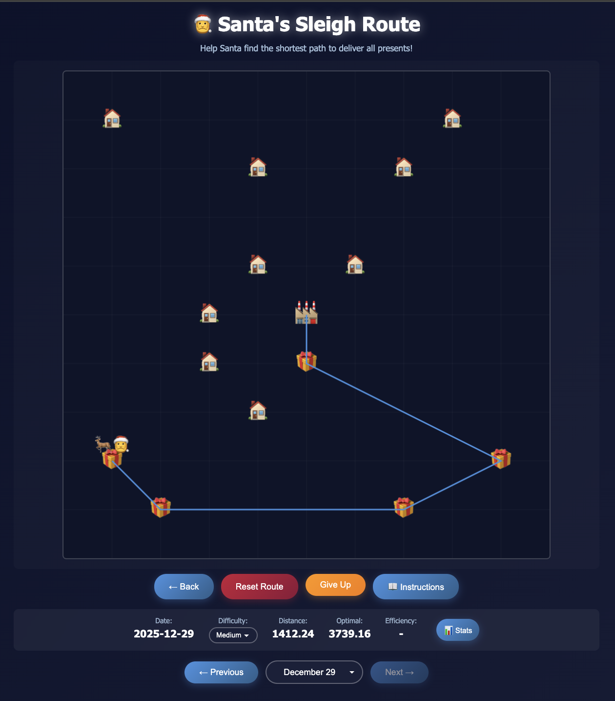

# Santa's Sleigh Route - Daily TSP Puzzle

A React-based traveling salesman puzzle game where you help Santa find the shortest path to deliver all presents!



## Development

```bash
# Install dependencies
npm install

# Start development server
npm run dev

# Build for production
npm run build

# Preview production build
npm run preview
```

## Switching Themes

To switch from the Christmas theme to the default theme (or any other theme), edit `src/themes/index.js` and change:

```javascript
const CURRENT_THEME = 'christmas';
```

to:

```javascript
const CURRENT_THEME = 'default';
```

Available themes:
- `christmas` - Santa's Sleigh Route theme (current)
- `default` - Generic TSP puzzle theme

To create a new theme, add a new theme file in `src/themes/` following the structure of existing themes, then add it to the `themes` object in `src/themes/index.js`.

## GitHub Pages Deployment

This project is set up to automatically deploy to GitHub Pages using GitHub Actions.

### Setup Instructions

1. **Enable GitHub Pages in your repository:**
   - Go to Settings → Pages
   - Under "Source", select "GitHub Actions"

2. **Update the base path** (if needed):
   - If your repo is `aussiedatagal/tourle`, the base path in `vite.config.js` is already set to `/tourle/`
   - If your repo name is different, update the `base` variable in `vite.config.js`
   - For user/organization pages (aussiedatagal.github.io), change the base to `/`

3. **Push to main branch:**
   - The workflow will automatically build and deploy on every push to `main`
   - You can also manually trigger it from the Actions tab

The site will be available at:
- `https://aussiedatagal.github.io/tourle/` (for project pages)
- `https://aussiedatagal.github.io/` (for user/organization pages)

### Manual Deployment

If you prefer to deploy manually:

```bash
# Build with GitHub Pages base path
GITHUB_PAGES=true npm run build

# Then push the dist folder to the gh-pages branch
# (or use a tool like gh-pages npm package)
```

